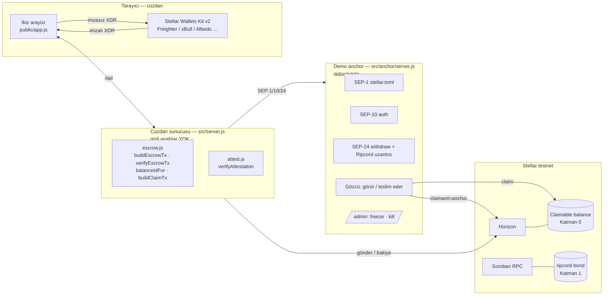
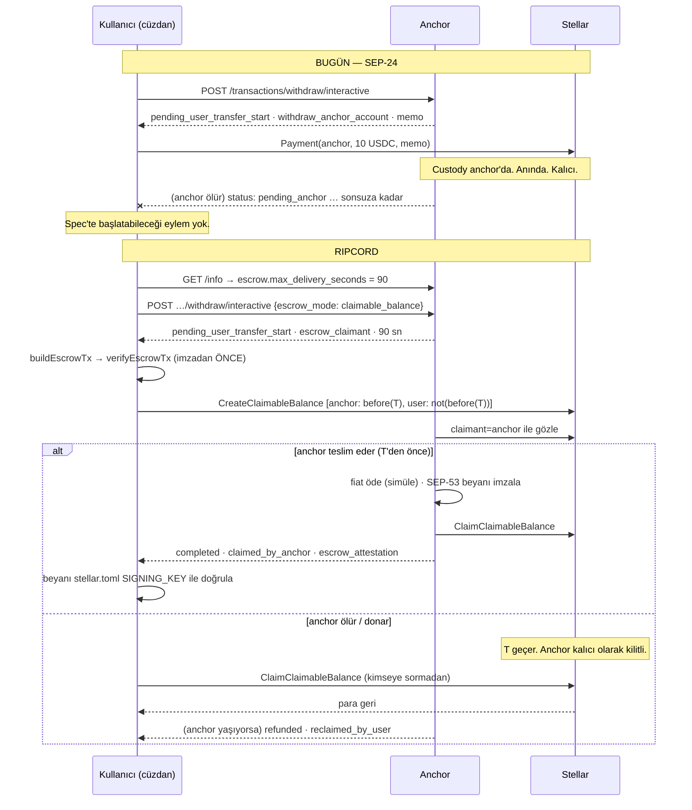
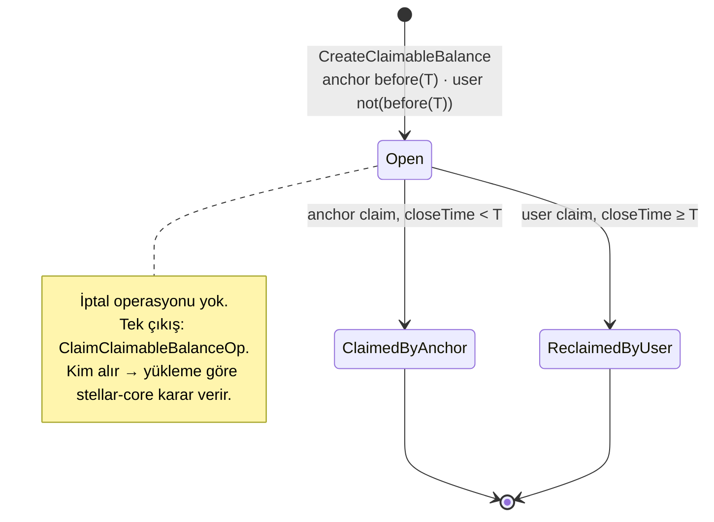
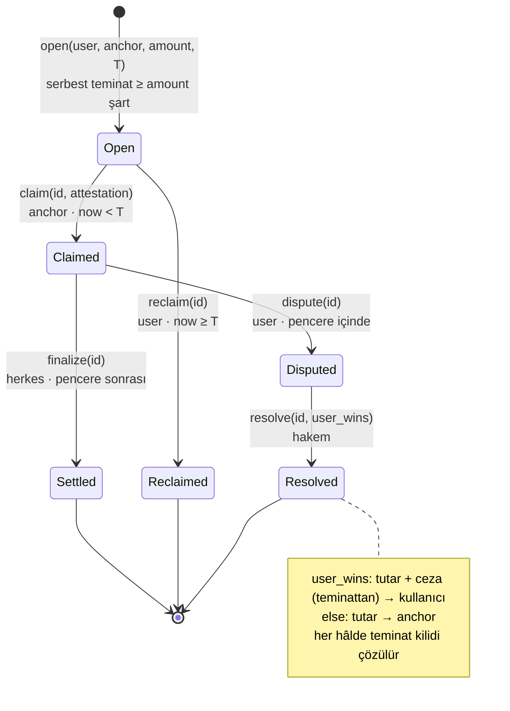

# Mimari

Scale Track şartı: Mermaid diyagramı sistemi doğru yansıtmalı. Aşağıdaki her diyagram
kodda çalışan bir şeyi gösterir; "planlanan" hiçbir kutu yok.

## Sistem görünümü



Üç süreç, üç güven alanı. Sahnede **anchor ölürken cüzdan sunucusu ayakta kalır** —
kullanıcının çıkışı anchor'a bağımlı değil, olması gereken bu.

## Aynı çekim, iki yol



## Katman 0 — yüklem ve durumlar



`before(T)` ⇔ `closeTime < T` · `not(before(T))` ⇔ `closeTime ≥ T`. Tam tümleyen.

## Katman 1 — ripcord-bond sözleşmesi



Hakem `bond()` anında anchor tarafından ilan edilir; açık yükümlülük varken değişemez.
Kullanıcı anchor'ı seçerek hakemi de seçmiş olur — güven modeli baştan görünür.

## Soroban tasarım kararları

| Karar | Gerekçe |
|---|---|
| Yükümlülük ve teminat **persistent**, yapılandırma **instance** | Yükümlülük kaybolursa fon kilitlenir; temporary kasten yok. |
| Her yazımda `extend_ttl(30 gün eşik → 180 gün)` | Mainnet tabanı ~120 gün; uzun emanetler için pay. |
| Son tarih girişin **değerinde**, TTL'de değil | CAP-46-12: TTL güvenlik sınırı değildir, herkes uzatabilir. |
| `claim` fonu **vermez**, pencere açar | Katman 0'ın açığı: "aldım" deyip ödememe. Pencere + teminat bunu pahalı kılar. |
| `finalize` herkes çağırabilir | Anchor'ın parasını alması için ek bir yetkiye gerek yok; kilitli kalmasın. |
| `open` serbest teminatı **kilitler** | Anchor üstlenemeyeceği yükümlülük alamaz. `stats()` = canlı ödeme gücü. |
| Hakem `bond()`'da sabit | Sonradan atanan hakem, güven modelini gizler. |
| Yönetici yok | `init` bir kez; yükseltme yolu yok. Küçük ve denetlenebilir. |

## Güven sınırı — açıkça

- **Zincir doğrulayamaz:** fiat bankaya ulaştı mı. Katman 2 beyanı "dedi/demedi"yi
  imzalı belgeye çevirir, gerçeği kanıtlamaz.
- **Hakem:** Katman 1'de güven hakemdedir; anchor'ın ilan ettiği, kullanıcının anchor'ı
  seçerek kabul ettiği bir taraf. Bu bir tasarım seçimidir, gizlenmez.
- **İhraççı:** clawback / `auth_revocable` protokolün dışındadır. USDC'de `auth_revocable: true`.
- **Demo anchor:** bizim. Fiat simüle. TOML'u öyle olduğunu söylüyor.

## Bileşenler ve sorumlulukları

| Dosya | Sorumluluk | Kanıt |
|---|---|---|
| `src/escrow.js` | Katman 0: yüklemler, balanceId, kur, doğrula, talep | 15 test · `escrow:check` |
| `src/attest.js` | Katman 2: SEP-53 beyan kur/imzala/doğrula | 8 test · `ui:check` |
| `src/units.js` | 7 ondalık tutar disiplini (BillRail'den) | 10 test |
| `src/anchor/server.js` | Demo anchor: SEP-1/10/24 + Ripcord ilanı + gözcü + kumanda | `anchor:check` |
| `src/server.js` | Cüzdan arka ucu: XDR kur/doğrula, gönder, beyan doğrula | `ui:check` |
| `public/` | İkiz arayüz, Wallets Kit | tarayıcı |
| `contracts/ripcord-bond` | Katman 1 | 9 Rust testi · `bond:check` |

## Nasıl test edilir

```
npm test               # 33 birim testi
npm run escrow:check   # Katman 0 testnet
npm run anchor:check   # anchor açıkken: SEP akışı + zombi + reclaim + legacy sıkışma
npm run ui:check       # iki sunucu açıkken: tarayıcı API sırası + SEP-53 + öldürme
npm run contract:test  # Katman 1, 9 test
npm run bond:check     # Katman 1 testnet: teminat, TooLate, reclaim, dispute, ceza
```
